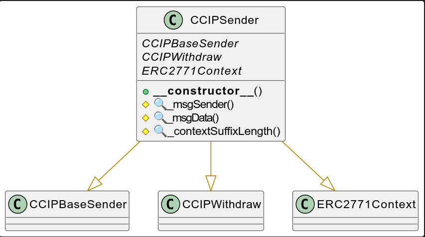
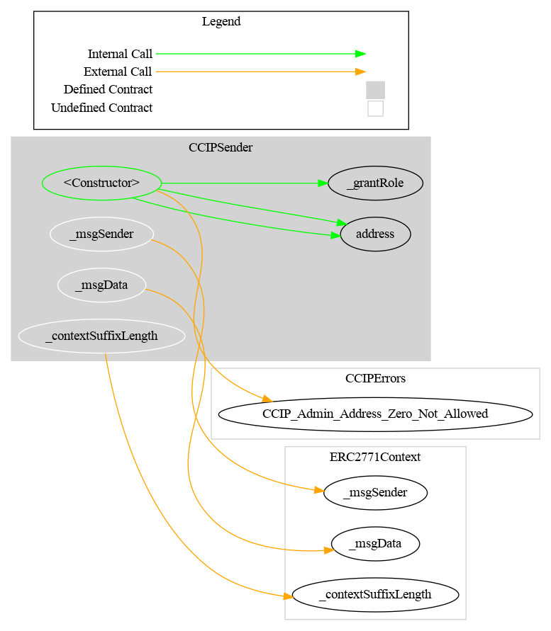

# CCIPSender

> This project is not audited. It is a PoC to interact with the CCIP bridge
> 
>If you want to use this project, perform your own verification !

# Overview

A sender contract serves as an entrypoint between your end user and the router contract from Chainlink. This contract is under your control and can be used to offer more possibility of customization.

The sender contract will be the main entrypoint for your user to bridge tokens. It will contain all the logic to transfer tokens and send messages.

More information in the [CCIP Chainlink website](https://docs.chain.link/ccip) and in the library CCIP in github [smartcontractkit/ccip](https://github.com/smartcontractkit/ccip)

The main reference is the [CCIP masterclass](https://andrej-rakic.gitbook.io/chainlink-ccip/ccip-masterclass/exercise-1-transfer-tokens)

## Module

We have divided the code into several components called modules. Each module is responsible to perform specific task.

| **Group**     | **Contract name**    | **Description**                                              |
| :------------ | :------------------- | :----------------------------------------------------------- |
|               | CCIPSender           | Our main contract to deploy                                  |
|               | CCIPBaseSender       | Our base contract providing the public transfer functions    |
| Security      |                      |                                                              |
|               | AuthorizationModule  | Manage the access control                                    |
| Wrappers      |                      |                                                              |
|               | CCIPSenderBuild      | Build a CCIP message                                         |
|               | CCIP Withdraw        | Withdraw native and fee tokens from the contracts            |
| Configuration |                      |                                                              |
|               | CCIPAllowlistedChain | Set and define the blockchain supported by the sender contract. |
|               | CCIPRouterManage     | Store the router contracts address and associated functions  |
|               | CCIPSenderPayment    | Compute fee required to transmit the transfer message        |


## Documentation

Here a summary of the main documentation

| Document                | Link/Files                             |
| ----------------------- | -------------------------------------- |
| Technical documentation | [doc/technical](./doc/technical.md)    |
| Toolchain               | [doc/TOOLCHAIN.md](./doc/TOOLCHAIN.md) |
| Surya report            | [doc/schem/surya](./doc/schema/surya)  |

## Deployment

The main contract is `CCIPSender`. This contract has to be deployed on each source chain where you want perform transfer.

## Schema

### UML




### Graph




## Usage

*Explain how it works.*


## Toolchain installation

The contracts are developed and tested with [Foundry](https://book.getfoundry.sh), a smart contract development toolchain.

To install the Foundry suite, please refer to the official instructions in the [Foundry book](https://book.getfoundry.sh/getting-started/installation).

## Initialization

You must first initialize the submodules, with

```
forge install
```

See also the command's [documentation](https://book.getfoundry.sh/reference/forge/forge-install).

Later you can update all the submodules with:

```
forge update
```

See also the command's [documentation](https://book.getfoundry.sh/reference/forge/forge-update).


## Compilation

The official documentation is available in the Foundry [website](https://book.getfoundry.sh/reference/forge/build-commands) 

```
 forge build --contracts src/deplyoment/CCIPSender.sol
```

## Testing

You can run the tests with

```
forge test
```

To run a specific test, use

```
forge test --match-contract <contract name> --match-test <function name>
```

See also the test framework's [official documentation](https://book.getfoundry.sh/forge/tests), and that of the [test commands](https://book.getfoundry.sh/reference/forge/test-commands).

### Coverage

* Perform a code coverage

```
forge coverage
```

* Generate LCOV report

```
forge coverage --report lcov
```

- Generate `index.html`

```bash
forge coverage --report lcov && genhtml lcov.info --branch-coverage --output-dir coverage
```

See [Solidity Coverage in VS Code with Foundry](https://mirror.xyz/devanon.eth/RrDvKPnlD-pmpuW7hQeR5wWdVjklrpOgPCOA-PJkWFU) & [Foundry forge coverage](https://www.rareskills.io/post/foundry-forge-coverage)
