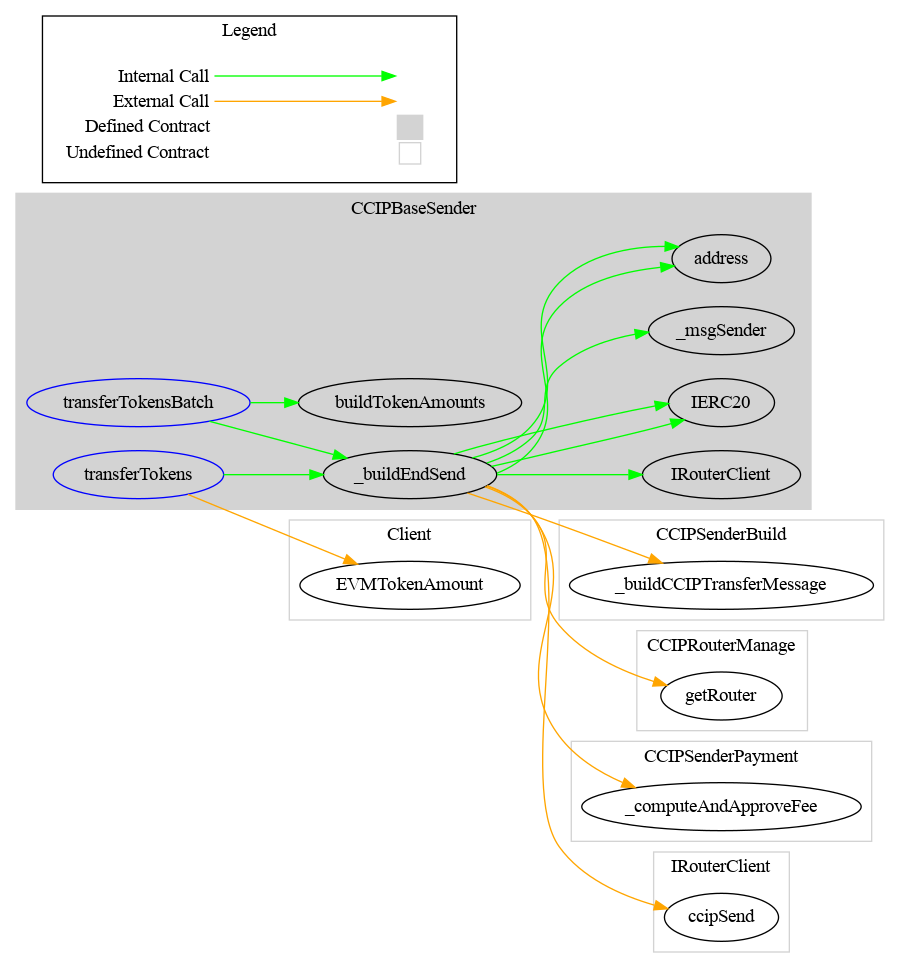
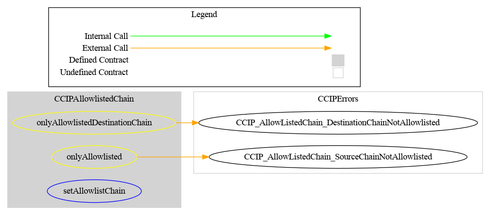
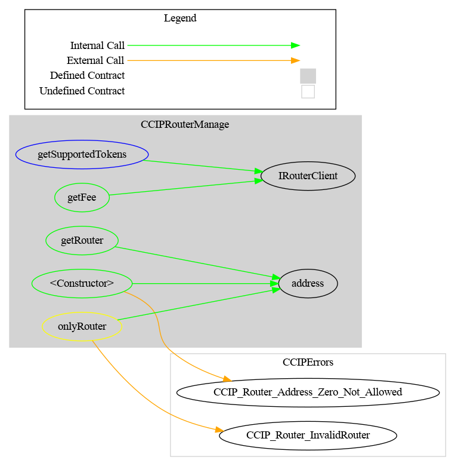
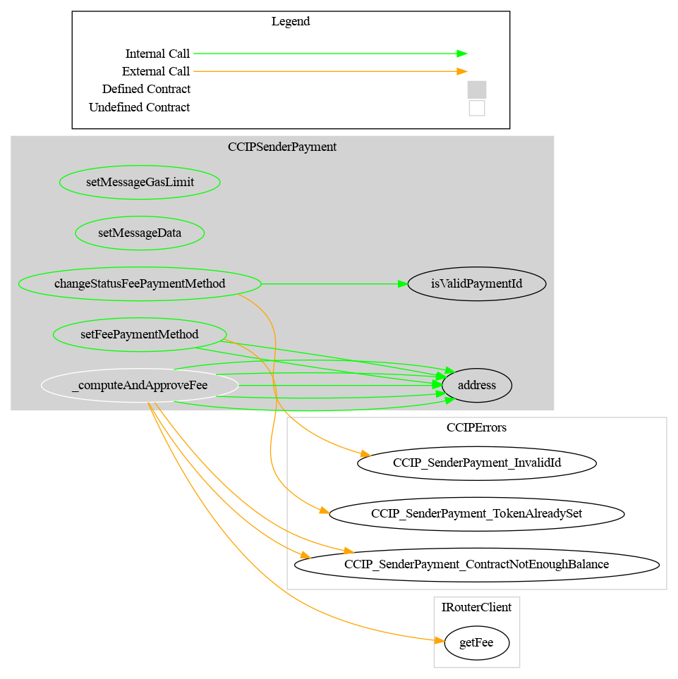
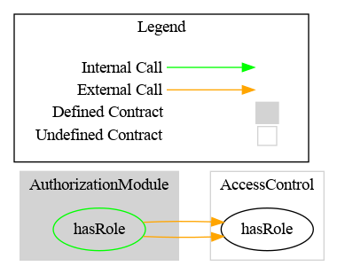

# Technical choice

[TOC]

## Configuration

### Configure the sender contract

Each sender contracts have to be deployed on the source blockchain.

You don't need to deploy contracts in the destination chain.

### Allow list chains

To allow a source and destination chains, you have to call the following function

```solidity
function setAllowlistChain(uint64 _chainSelector,bool allowedSourceChain, boolallowedDestinationChain) 
```

 Example for Avalanche:

```solidity
setAllowlistChain(6433500567565415381, true, true)
```

### Authorize user to use the contracts

Our function `transferTokens` from our sender contract is protected by an access control. Only authorized user can transfer tokens. Therefore we will authorize our

```solidity
grantRole(bytes32 role, address account)
```

Example

```solidity
grantRole(`b0f04d2e44f4b417ab78712b52802767b073e39f75dba9f6e3a31125b053f026`, <Sender address>)
```

 

## Functionality

### Upgradeable

The CCIPSender contract is not upgradeable. 

### Urgency mechanism

Pause
There are no functionalities to put in pause the contracts.


### Gasless support

The CCIPSender contract supports client-side gasless transactions using the [Gas Station Network](https://docs.opengsn.org/#the-problem) (GSN) pattern, the main open standard for transfering fee payment to another account than that of the transaction issuer. The contract uses the OpenZeppelin contract `ERC2771Context`, which allows a contract to get the original client with `_msgSender()` instead of the fee payer given by `msg.sender` .

At deployment, the parameter  `forwarder` inside the contract constructor has to be set  with the defined address of the forwarder. Please note that the forwarder can not be changed after deployment.

Please see the OpenGSN [documentation](https://docs.opengsn.org/contracts/#receiving-a-relayed-call) for more details on what is done to support GSN in the contract.

## Schema

### UML


## Graph

### CCIPSender


### CCIPBaseSender



### Wrapper

**CCIPSenderBuild**


**CCIPWithdraw**


### Configuration

#### CCIPAllowlistedChain




#### CCIPRouterManage



#### CCIPSenderPayment




### Security

**AuthorizationModule**


